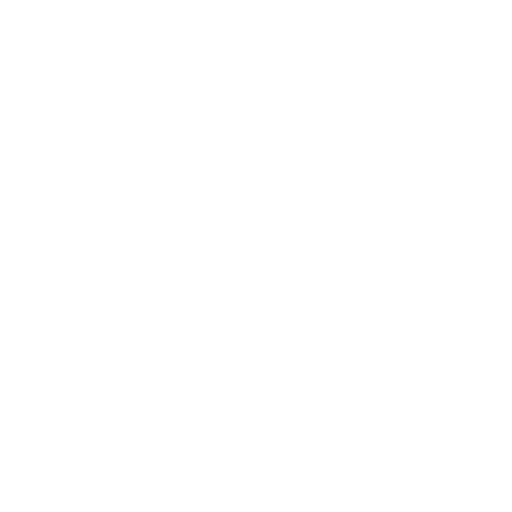

<h1 align="center">Hi 👊, I'm <a href="https://100rabhcsmc.github.io/Me.io/" target="blank">
Sebastian</a> 👊</h1>

<h3 align="center">Developer passionate about the multiple emotions that programming generates at 3 in the morning</h3>

 

- 🔭Currently, I work on React and Node.js projects at Atento, generating solutions for various companies.

- 🌱 Learning technologies like **Next.js**, **React Native**, and looking for new ones to improve my projects/work.

- 💬 Ask me about web development.

- 📫 Cómo contactarme: **jsebastian.avendano@gmail.com**.

- 📄 Download my resume here: [[ **Click** ](https://github.com/AvendanoisPepe/AvendanoisPepe/tree/main/assets/ingles.pdf)].

  

---

## 🌟 ----- Featured Projects ----- 🌟

| Portafolio | AirBnB_clone_v4 | Multiple Repositories |
| ----------- | ----------- | ----------- |
| 
Project generated with React, Jsx, Node.js, and multiple design functions with the intention of showing a little of my life to the world. 
 
**[Mi Portafolio](https://github.com/AvendanoisPepe/portafolio)**
 

  | 
During my last period of study I got to touch Python, C, where they focused especially on programming logic and in the same way previous knowledge such as Js and web design was highlighted.
 
**[AirBnB_clone_v4](https://github.com/AvendanoisPepe/AirBnB_clone_v4)**
 

  | 
Since I have been working at Atento for quite some time, most of my work/developments are in the respective company's repository, so I cannot link to it, but in the Portfolio you can see some work done.
 

 |

<h3 align="center" > Connect with me 🤝 </h3>
 

        
        
        
		
	 
      

